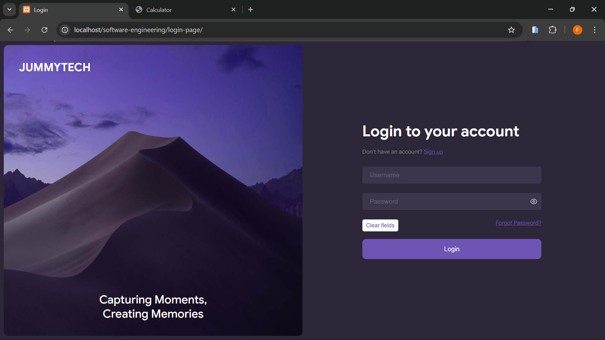
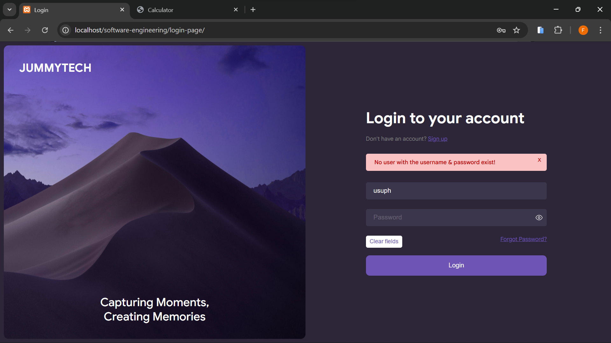
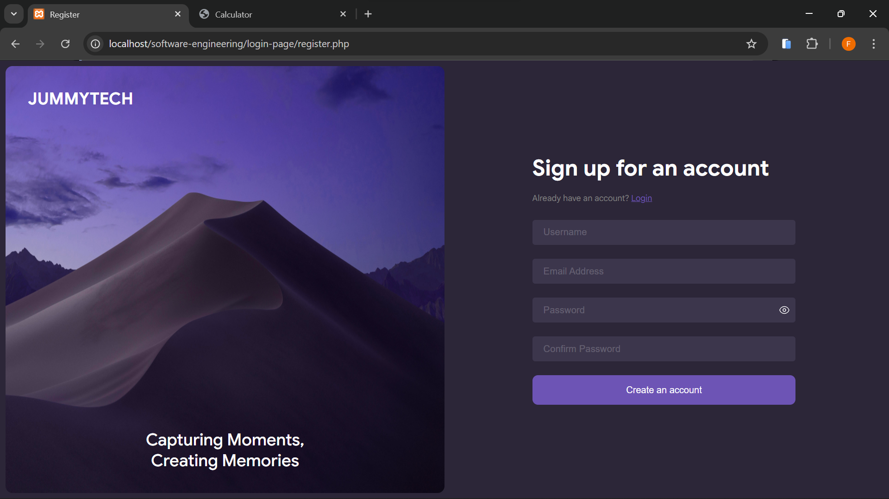
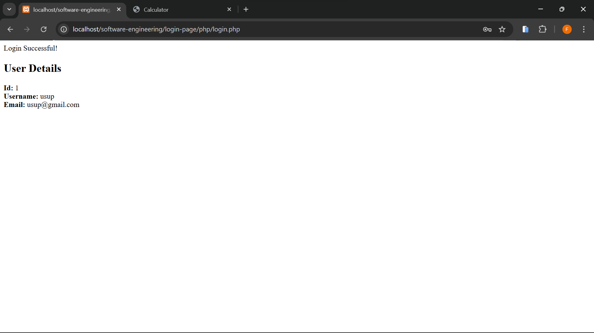

# Login Page Project

A PHP/MySQL login and registration example.

## Files
- [index.php](index.php) — Login page.
- [register.php](register.php) — Registration page.
- [css/style.css](css/style.css) — Styles.
- [js/script.js](js/script.js) — Small client JS (show/hide passwords).
- [php/db.php](php/db.php) — Database connection.
- [php/helper.php](php/helper.php) — Session helper functions: [`has_error`](php/helper.php), [`error`](php/helper.php), [`errors`](php/helper.php), [`input`](php/helper.php).
- [php/create-account.php](php/create-account.php) — Registration handler.
- [php/login.php](php/login.php) — Login handler.

## Requirements
- PHP 7.4+ (or PHP 8)
- MySQL
- Local server (XAMPP / MAMP / LAMP)

## Setup (quick)
1. Copy the project folder into your web server document root (e.g., XAMPP `htdocs`).
2. Start Apache and MySQL.
3. Create the database and users table:

```sql
-- Run in MySQL (phpMyAdmin or CLI)
CREATE DATABASE IF NOT EXISTS school_login_page;
USE school_login_page;

CREATE TABLE IF NOT EXISTS users (
  id INT AUTO_INCREMENT PRIMARY KEY,
  username VARCHAR(100) NOT NULL UNIQUE,
  email VARCHAR(255) NOT NULL UNIQUE,
  password VARCHAR(255) NOT NULL,
  last_login_at DATETIME NULL,
  created_at TIMESTAMP DEFAULT CURRENT_TIMESTAMP
); 
```
4. Update DB credentials in php/db.php if needed.

## How to use
- Open index.php in your browser to login.
- Open register.php to create a new account.
- Handlers:
  - Registration uses php/create-account.php.
  - Login uses php/login.php.

## Notes
- Passwords are hashed with PHP's password_hash / password_verify.
- Form validation sets errors into session and uses helpers in php/helper.php.

# Screenshots for Login Page Project


  **The login page (username & password fields).**
  

  **User not match error response.**
  

  **Input error response.**
  

  **The registration page (create a new account form).**


**The confirmation after a successful registration or login.**